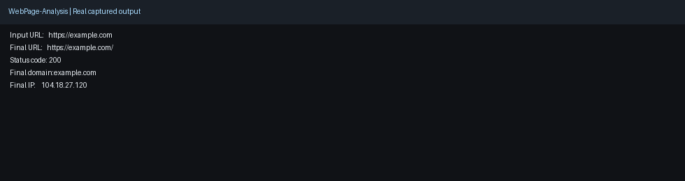

# WebPage-Analysis

A webpage and URL triage toolkit for defensive analysis and investigation workflows.

## Why this project

- **Impact:** Speeds up URL and page triage for suspicious web artefacts.
- **Scale:** Supports lightweight CLI use and structured output for automation.
- **Use case:** Redirect analysis, header checks, link extraction, and surface-level web investigation.

## Demo media

- Screenshot: 
- Demo GIF: 

## Capability snapshot

- Redirect chain resolution and URL unshortening
- Header, security.txt, and status-code inspection
- Link extraction workflows with JSON output options

## Featured Tool: HREF-Link-Extractor.sh

`HREF-Link-Extractor.sh` is the strongest script in this repo for fast link triage.

It supports:
- absolute URL normalization
- optional relative-link handling
- domain-only mode for quick asset pivots
- JSON output for automation/pipelines
- summary stats (total hrefs, unique links, external vs same-domain)

Quick examples:
```bash
./HREF-Link-Extractor.sh https://example.com
./HREF-Link-Extractor.sh --domain-only https://example.com
./HREF-Link-Extractor.sh --output json --include-relative https://example.com
```

## Other Tools

- `un-shorten.sh` — resolve redirects, chain, final domain/IP, and JSON/batch output
- `get-headers.sh` — fetch HTTP response headers
- `get-securitytxt.sh` — fetch and parse `security.txt`
- `webpage-parse.sh` — extract links/emails from webpage HTML
- `check-http-status-code.sh` — explain HTTP status codes
- `qa_check.sh` — syntax + shellcheck validation

## Usage

```bash
./un-shorten.sh https://bit.ly/example
./un-shorten.sh --chain https://bit.ly/example
./un-shorten.sh --json https://bit.ly/example
./un-shorten.sh -f urls.txt --json
./get-headers.sh https://example.com
./get-securitytxt.sh example.com
./get-securitytxt.sh --json example.com
./get-securitytxt.sh --strict example.com
./webpage-parse.sh https://example.com
./HREF-Link-Extractor.sh https://example.com
./HREF-Link-Extractor.sh --domain-only https://example.com
./HREF-Link-Extractor.sh --output json --include-relative https://example.com
./check-http-status-code.sh 404
./qa_check.sh
```

## Notes

- Scripts are read-only and intended for authorized defensive/OSINT use.
- Network timeouts and temporary web errors are handled where possible.
- For reproducible output in pipelines, prefer `--no-color` where supported.

## Quick Demo

```bash
# 1) Run a core check
# 2) Request JSON output
# 3) Pipe into jq for analyst workflows
```

